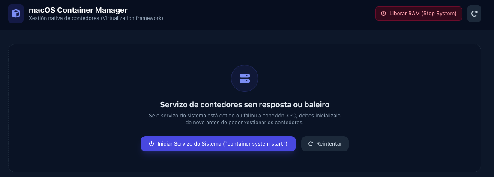
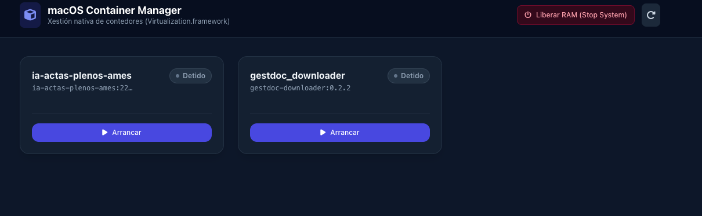
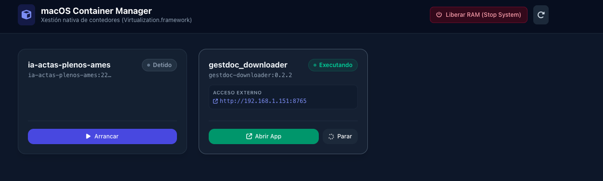
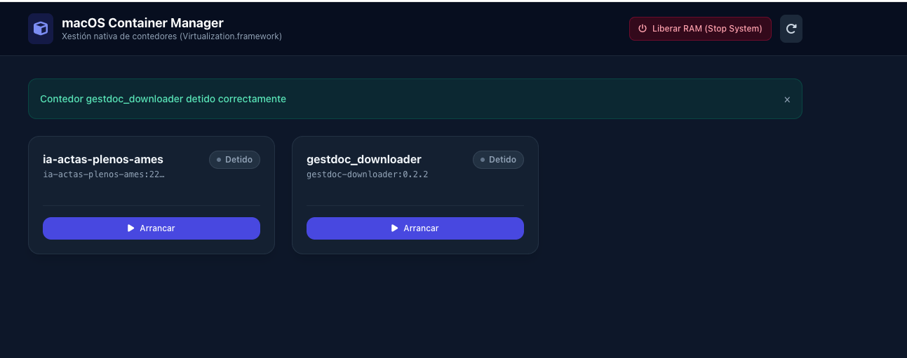

# App containers macos

Lanza containers creados con `container`


## Uso

```bash
$ uvicorn app:app --reload --port 8080
```

Con debug:

```bash
$ DEBUG=1 uvicorn app:app --reload --port 8080
```

## Screenshots









## Howto

Para que aparezan os containers no listado tenhen que estar creados:
- hai que crealos con `build`, polo que necesitan todos un `Dockerfile` sempre
- hai que lanzalos con `run` e sen `--rm`
- calquera container creado aparece reflexado na web, non hai discriminación por tag ou calquera outro tipo de medida.


### ToDo 
- discriminar containers creados por tag propio?
